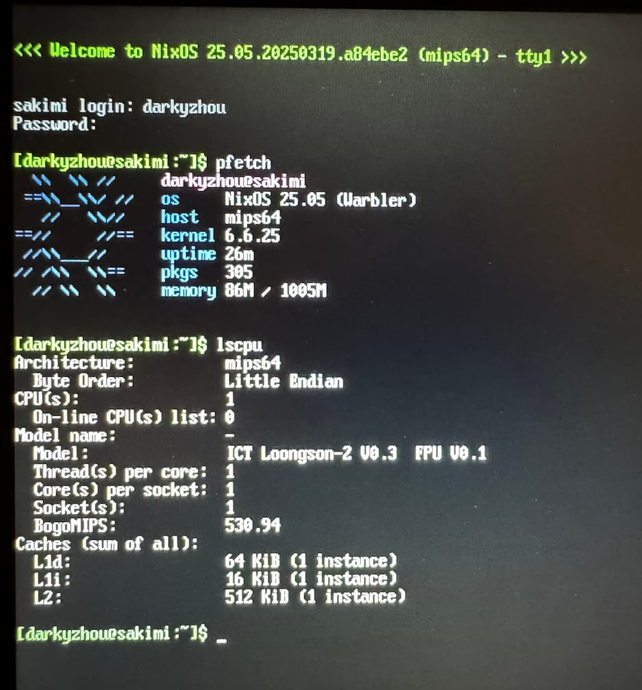

# nixos-loongson2f

A NixOS 25.05 Snapshot specifically designed for [Lemote 8089-series notebooks](https://arc.net/l/quote/ixioidcv), tested on the Lemote 8089A model.

## Screenshots



## Pre-installed Packages

```nix
# configuration.nix
environment.systemPackages = with pkgs; [
    jq
    lm_sensors
    pciutils
    wpa_supplicant
    gcc
    binutils
    curl
    htop
    pfetch
    # JavaScript runtime based on QuickJS-NG, see txiki/default.nix
    txiki
];
```

## Installation

1. Download the latest prebuilt image from the releases section.
2. Flash the image to your hard drive.

    If you plan to use a USB drive, you may need to replace all occurrences of `(wd0,0)` with `(usb0,0)` in the source and build the image yourself.

3. Boot your notebook.

    You may need to update both the EC firmware and PMON bootloader following [kusahae's guide](https://zhuanlan.zhihu.com/p/359628282). The two firmware files mentioned in the guide are also provided in `firmware` folder.

4. Log in using the `root` account with the default password `114514`.
5. Expand the root partition by running `resize2fs /dev/disk/by-label/sakimi-nixos`.

## Known Issues

- Rust support is currently a work in progress. While [wangjiezhe's guide](https://wangjiezhe.com/posts/2024-08-06-Cross-compile-Rust-for-Lemote-Yeeloong-netbook/) suggests patching the Rust compiler directly, I found applying this patch in NixOS quite challenging.
- Many packages in nixpkgs are not compatible with the `mips64` architecture and fail to compile.

## Acknowledgements

This project builds upon the work of:

- dramforever: https://github.com/dramforever/nixos-loongson2f
- kusahae: https://zhuanlan.zhihu.com/p/359628282